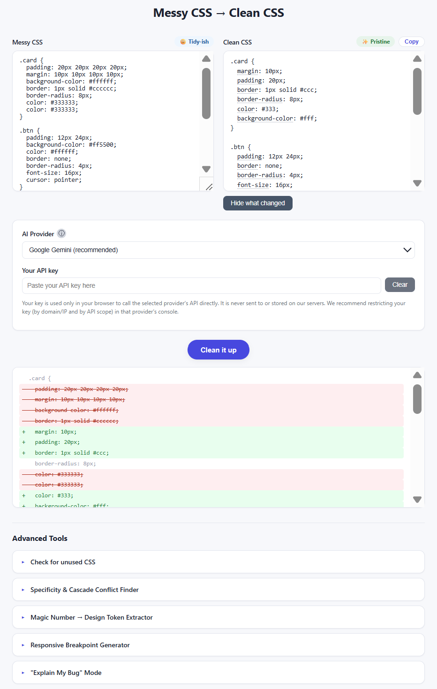

# Messy CSS → Clean CSS

A browser-based tool that cleans, validates, and analyzes CSS — powered by your own AI API key (Gemini, OpenAI, or Anthropic). No backend, no account, no shared rate limits: everything runs client-side in your browser.

🔗 **Live demo:** https://mehrdad-elahi.github.io/messy-css-to-clean-css/

## Why "bring your own key"?

This project originally used a shared API key, but that quickly ran into rate-limit issues — one user's heavy usage could block everyone else. Switching to a bring-your-own-key model solves that permanently: your usage is yours alone, and you're never waiting on anyone else's quota.

## Features

- **Clean it up** — reformats messy CSS: consistent indentation, duplicate removal, shorthand collapsing, logical property ordering — without changing visual behavior.
- **Real CSS validation** — catches syntax errors and invalid property/value pairs using a real CSS parser (`csstree`), not regex guessing.
- **Ask AI / Fix it for me** — when something's broken, get a plain-English diagnosis or an automatic fix.
- **Mood Meter** — a live "chaos level" badge that reacts to how messy your CSS currently is.
- **Hover explanations** — hover any property in the cleaned output for a plain-English description.
- **Show what changed** — a real line-by-line diff between your original and cleaned CSS.
- **Advanced Tools**
  - Dead & Unused CSS Detector
  - Specificity & Cascade Conflict Finder
  - Magic Number → Design Token Extractor
  - Responsive Breakpoint Generator
  - "Explain My Bug" Mode — describe a visual problem, get a diagnosis and fix

## Your API key, and your safety

Your key is used **only in your browser** to call your chosen provider's API directly. It is never sent to, or stored on, any server we control — there is no backend at all.

We recommend restricting your key (by domain and by API scope) in your provider's console, and using a key that isn't shared with other paid services.

## Usage

1. Open the [live site](https://mehrdad-elahi.github.io/messy-css-to-clean-css/).
2. Paste your CSS into the left box.
3. Select your AI provider and paste your API key.
4. Click **Clean it up** — or explore the Advanced Tools accordion below.

## Local development

Clone the repo and open `index.html` with any static file server (e.g. VS Code's Live Server extension). No build step, no dependencies to install.

## License

MIT — see [LICENSE](LICENSE).
